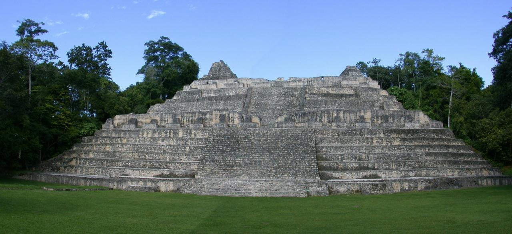
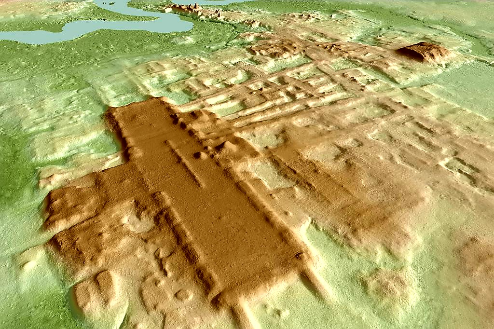

# MayaScan

**Automated LiDAR Archaeological Detection Pipeline (CLI + Streamlit)**

*From raw LiDAR to ranked archaeological targets in one run.*

---

## Table of Contents

- [Overview](#overview)
- [Responsible Use](#responsible-use)
- [Project Background](#project-background)
- [What You Get](#what-you-get)
- [Installation](#installation)
- [Quick Start (Streamlit App)](#quick-start-streamlit-app)
- [Quick Start (CLI)](#quick-start-cli)
- [End-to-End Pipeline](#end-to-end-pipeline)
- [LiDAR Data Sources](#lidar-data-sources)
- [Key Parameters (Practical Meaning)](#key-parameters-practical-meaning)
- [Known Limitations](#known-limitations)
- [Technologies Used](#technologies-used)
- [AI-Assisted Development](#ai-assisted-development)
- [Skills Demonstrated](#skills-demonstrated)
- [Repository Structure](#repository-structure)
- [Future Work](#future-work)
- [License](#license)
- [Author](#author)
- [Image Credits](#image-credits)

---

## Overview

*From Visible Ruins to Hidden Landscapes*

<p align="center">
  
</p>
<p align="center">
  <em>Caana pyramid at Caracol, Belize — visible monumental architecture</em>
</p>

<p align="center">
  
</p>
<p align="center">
  <em>LiDAR terrain model of Aguada Fénix, Mexico — large-scale Maya architecture revealed beneath forest canopy</em>
</p>

Airborne LiDAR can reveal landscape-scale archaeological features that are often invisible at ground level. The challenge is no longer discovery alone; it is prioritizing large terrain datasets for expert review.

**MayaScan** is a Python-based geospatial pipeline that converts raw LAZ/LAS point clouds into terrain models, automatically detects and ranks candidate archaeological features, and provides an integrated review workflow through both a command-line interface and a Streamlit web app.

Using multi-scale relief analysis and spatial density modeling, MayaScan highlights subtle topography, identifies potential anthropogenic structures (mounds, platforms, terraces, and settlement patterns), clusters them spatially, and generates GIS-ready outputs and interactive reports. It has been tested on publicly available OpenTopography datasets (e.g., Caracol, Belize).

### Key capabilities

- LAZ/LAS → DTM, LRM, and density surfaces
- Automated candidate detection and scoring
- Settlement clustering using DBSCAN
- Interactive HTML reports with cutouts and metrics
- GIS-ready exports (CSV, GeoJSON, KML)
- Streamlit interface for end-to-end review

---

## Responsible Use

This project is intended for research, education, and software engineering demonstration.

- MayaScan identifies **terrain anomalies**, not confirmed archaeological sites.
- Results require **expert review and ground validation**.
- Location information should be handled responsibly to avoid site disturbance or looting.
- This repository **does not include LiDAR datasets or derived site location outputs**.
- The project intentionally avoids publishing curated site interpretations or sensitive geographic information.

This repository is shared as a **portfolio and technical demonstration** of geospatial terrain-processing workflows.

---

## Project Background

Airborne LiDAR has transformed Maya archaeology by revealing landscapes hidden beneath dense tropical canopy. The challenge now is prioritizing millions of terrain cells and subtle features for expert review.

MayaScan was built to:

- Automatically extract candidate structures from a LiDAR tile  
- Identify settlement clusters and spatial patterns  
- Rank features by likelihood of anthropogenic origin  
- Generate outputs that make expert review fast and intuitive  

**Optimized for**
- Low-relief tropical landscapes  
- Subtle platforms and mounds (0.3–2 m relief)  
- Rapid exploratory workflows  

---

## What You Get

### Outputs (per run)

- GeoTIFFs (DTM, LRM, density)
- CSV candidate table (`candidates.csv`)
- GeoJSON / KML exports (`candidates.geojson`, `candidates.kml`)
- Plots and histograms (`plots/`)
- Markdown + optional PDF summary (`report.md`, `report.pdf`)
- Optional interactive HTML report with map + cutout panels (`report.html`, `html/img/`)

### Review UX (Streamlit App)

A lightweight Streamlit UI wraps the CLI pipeline so you can upload a `.laz/.las` tile (or use a local path), tune thresholds with tooltips, run the pipeline with live logs, and review results in one place:
- Interactive Leaflet map (Street + Satellite basemap toggle, no API keys)
- Ranked candidates table
- Candidate cutout panels (LRM + hillshade)
- Embedded `report.html` (when enabled)
- Download actions for CSV, GeoJSON, KML, and whole-run ZIP

---

## Example Results

*Sample outputs from a typical MayaScan run.*

> WIP: Demo screenshots (`assets/demo_streamlit.png`, `assets/demo_report.png`) will be added soon.

Typical results include:
- Ranked candidate features prioritized by score
- Spatial clustering highlighting settlement patterns
- Multi-scale terrain visualizations (LRM, hillshade, density)

---

## Installation

### Requirements
- Python 3.10+ (requirements currently specify minimums)
- **PDAL installed separately** (system install)
- `scikit-learn` for DBSCAN clustering (installed by default via `requirements.txt`)
- `reportlab` for PDF report output (installed by default via `requirements.txt`)

Python package minimums in `requirements.txt`:
- `numpy>=1.23`, `scipy>=1.9`, `pandas>=1.5`
- `rasterio>=1.3`, `pyproj>=3.4`, `shapely>=2.0`
- `scikit-learn>=1.2`, `streamlit>=1.30`

**PDAL must be installed separately.** Example installs:

- macOS: `brew install pdal`
- Ubuntu: `sudo apt install pdal`
- Windows (conda): `conda install -c conda-forge pdal`

Install Python dependencies:

```bash
pip install -r requirements.txt
```

Sanity checks:
- `pdal --version` should work
- `python -c "import rasterio, pyproj, scipy"` should work

---

## Quick Start (Streamlit App)

If you have the Streamlit app file in the repo (example: `app.py`), run:

```bash
# Run the Streamlit app
streamlit run app.py
```

Then:
1. Upload a `.laz/.las` tile (or use a local path)
2. Set a run name + parameters
3. Click **Run MayaScan**
4. Review map, ranked candidates, report, and downloads in the **Results** tab.

Outputs are saved to:

```
runs/<run_name>/
```

## Quick Start (CLI)

Place a LiDAR tile locally (example):

```
data/lidar/bz_hr_las31_crs.laz
```

(LiDAR data is not included in this repository.)

Run MayaScan:

```bash
python maya_scan.py \
  -i data/lidar/bz_hr_las31_crs.laz \
  --name example_run \
  --overwrite \
  --try-smrf \
  --pos-thresh auto:p96 \
  --min-density auto:p55 \
  --density-sigma 40 \
  --min-peak 0.50 \
  --min-area-m2 25 \
  --min-extent 0.35 \
  --max-aspect 4.0 \
  --cluster-eps auto \
  --min-samples 4 \
  --report-top-n 30 \
  --label-top-n 60
```

Outputs will be written to:

```
runs/example_run/
```

Open the interactive report:

```
runs/example_run/report.html
```

---

## End-to-End Pipeline

### 1. Ground Model (DTM)
- PDAL converts LAZ/LAS → raster DTM
- Optional SMRF ground classification
- 1 m resolution GeoTIFF

### 2. Multi-scale Local Relief Model (LRM)
- Small-scale smoothing (σ = 1–2)
- Large-scale smoothing (σ = 8–16)
- Difference (small − large)

Highlights subtle anthropogenic topography.

### 3. Region Detection
Connected-component extraction with filters:
- Minimum size (pixel count)
- Region slope limit (q75 of slope values in each region)
- Morphological cleanup

### 4. Shape Metrics
For each region:
- Area
- Peak / mean relief
- Extent (area / bounding box) *(compactness / “filled-ness”)*
- Aspect ratio *(elongation)*
- Width / height (meters)

### 5. Settlement Density Modeling
- Binary mound mask
- Gaussian smoothing
- Percentile thresholding
- Region-level density statistics (mean/q75) per candidate region

### 6. Scoring

```
score = (density^a) × (peak^b) × (extent^c) × √area
```

Where `density` is the **region mean density** (not a single centroid pixel).

### 7. Spatial Clustering
- Meter-based coordinates for clustering/distances (projected CRS is used directly with unit→meter conversion when needed; geographic CRS auto-projects to UTM)
- DBSCAN clustering
- Automatic epsilon selection (optional)
- Distance to cluster core

### 8. Outputs
Produces the run artifacts listed in [What You Get](#what-you-get).

---


## LiDAR Data Sources

Public datasets can be obtained from:

**OpenTopography**  
<https://opentopography.org/>

Example workflow:
1. Create a free OpenTopography account  
2. Find a dataset and select an area of interest (e.g., Belize / Caracol)  
3. Download LAZ tiles and place them in:

```
data/lidar/
```

### API Access

MayaScan currently processes only locally downloaded data.  
No API key is required.

---

## Key Parameters (Practical Meaning)

- `--pos-thresh auto:p96`  
  Relief threshold for candidate detection in the LRM. Higher percentile = fewer, stronger bumps.

- `--min-density auto:p55` + `--density-sigma 40`  
  Builds a smoothed “feature density” raster, suppressing isolated noise and emphasizing settlement-like zones. Candidate gating/scoring use **region mean density**.

- Internal region slope filter (default 25°)  
  Uses the **75th percentile slope (q75)** over each region footprint to reject steep/noisy terrain artifacts.

- Shape cleanup filters:
  - `--min-peak` (m): drop tiny terrain wiggles
  - `--min-area-m2` (m²): drop very small patches
  - `--min-extent` (0–1): keep coherent/filled regions (area / bbox_area)
  - `--max-aspect` (≥1): drop long skinny ridge-like artifacts

- `--cluster-eps auto` + `--min-samples 4`  
  DBSCAN clustering in **meters** (projected CRS units are converted to meters when needed; geographic CRS auto-projects to UTM). Useful for settlement pattern grouping.

- `--score-extent-exp`  
  Controls exponent `c` in `score = density^a × peak^b × extent^c × √area`. Higher values favor compact/high-extent regions. (CLI advanced option; Streamlit currently uses the default.)

---

## Known Limitations

- MayaScan flags terrain anomalies, not confirmed archaeology; expert interpretation is required.
- False positives can increase in rugged terrain, modern earthworks, or heavily modified agricultural zones.
- Newer region-level filtering can produce fewer candidates and lower absolute scores than centroid-based filtering; this is expected and often improves ranking stability.
- Performance depends on point-cloud quality, ground classification quality, and chosen thresholds.
- Current workflow is primarily tuned for single-tile or tile-at-a-time exploratory analysis.

---

## Technologies Used

Python · NumPy · SciPy · Rasterio · PyProj  
PDAL · GeoTIFF · UTM reprojection  
Scikit-learn (DBSCAN)  
Matplotlib · Leaflet · ReportLab  
Streamlit (UI wrapper)

---

## AI-Assisted Development

Large language models were used to assist with:
- Architecture exploration
- Debugging geospatial workflows
- Rapid prototyping
- Documentation refinement

All design decisions, validation, and interpretation were performed manually.

---

## Skills Demonstrated

- End-to-end data pipeline design  
- Large-scale raster processing  
- Coordinate systems and spatial analysis  
- Density modeling and clustering  
- Multi-scale signal processing  
- Automated reporting and visualization  
- Building a review UI (Streamlit) for fast analyst workflows

---

## Repository Structure

Tracked in this repository (typical):

```
MayaScan/
├── maya_scan.py          # CLI pipeline
├── app.py                # Streamlit UI (runs the CLI, renders results)
├── README.md
├── requirements.txt
├── .gitignore
└── data/
    └── lidar/
        └── .gitkeep
```

Generated locally (gitignored):

```
runs/
data/lidar/*.laz
data/lidar/*.las
data/lidar/*.tif
```

---

## Future Work

- Multi-tile regional analysis
- Linear feature detection
- ML-based classification
- Parameter auto-tuning

---

## License

This project is licensed under the MIT License. See `LICENSE` for details.

---

## Author

**James Adelhelm**  
Software Developer — Data Ingestion, AccuWeather  

MayaScan is an independent personal research project and is **not affiliated with AccuWeather**.

**Professional focus**
- Scala development for operational weather data systems  
- High-volume ingestion of global meteorological alerts  
- Reliable cloud-based data processing pipelines  

**Personal research interests**
- Mesoamerican archaeology and Maya history  
- LiDAR-based settlement analysis  
- Landscape-scale interpretation  

This project reflects a personal interest in Maya history and explores how modern software engineering can be applied to large-scale archaeological terrain analysis.

---

## Image Credits

**Caana, Caracol (Belize)**  
Photo by Devon Jones — Wikimedia Commons  
License: CC BY-SA 3.0  
<https://commons.wikimedia.org/wiki/File:Caracol-Temple.jpg>

**Aguada Fénix LiDAR**  
Courtesy of Takeshi Inomata — Wikimedia Commons  
License: CC BY-SA 4.0  
<https://commons.wikimedia.org/wiki/File:Aguada_F%C3%A9nix_1.jpg>
